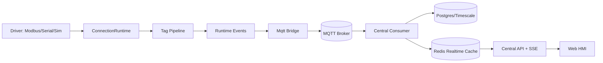
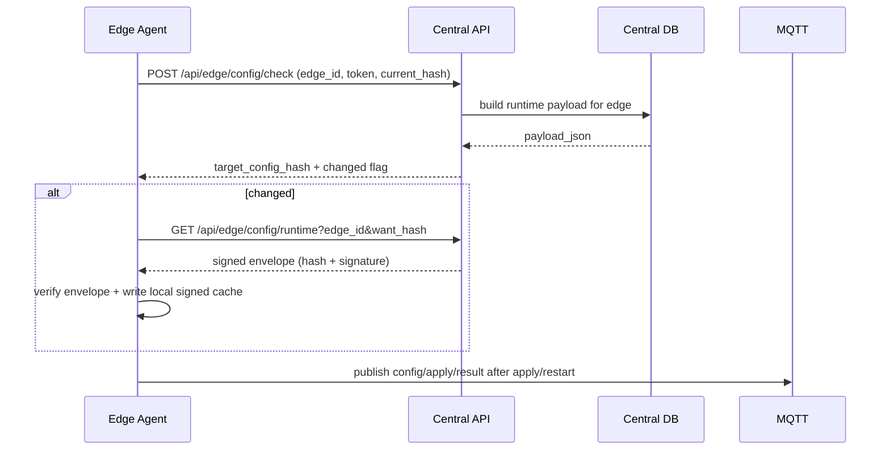
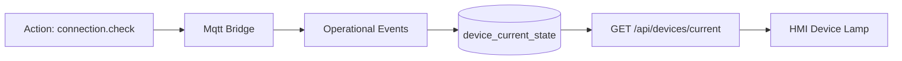

# SCADA Runtime Architecture Diagrams

## Edge to Central Data Flow

```mermaid
flowchart LR
    D1[Driver: Modbus/Serial/Sim] --> RT[ConnectionRuntime]
    RT --> TP[Tag Pipeline]
    TP --> EV[Runtime Events]
    EV --> BR[Mqtt Bridge]
    BR --> MQ[(MQTT Broker)]
    MQ --> CS[Central Consumer]
    CS --> PG[(Postgres/Timescale)]
    CS --> RC[(Redis Realtime Cache)]
    RC --> API[Central API + SSE]
    API --> HMI[Web HMI]
```

## Signed Config Governance

```mermaid
sequenceDiagram
    participant E as Edge Agent
    participant A as Central API
    participant DB as Central DB
    E->>A: POST /api/edge/config/check (edge_id, token, current_hash)
    A->>DB: build runtime payload for edge
    DB-->>A: payload_json
    A-->>E: target_config_hash + changed flag
    alt changed
        E->>A: GET /api/edge/config/runtime?edge_id&want_hash
        A-->>E: signed envelope (hash + signature)
        E->>E: verify envelope + write local signed cache
    end
    E->>MQTT: publish config/apply/result after apply/restart
```

## On-Demand Device Status (Phase 4/6 Operability)

```mermaid
flowchart LR
    AC[Action: connection.check] --> BR[Mqtt Bridge]
    BR --> OPEV[Operational Events]
    OPEV --> DCS[(device_current_state)]
    DCS --> API[GET /api/devices/current]
    API --> LAMP[HMI Device Lamp]
```
